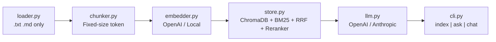
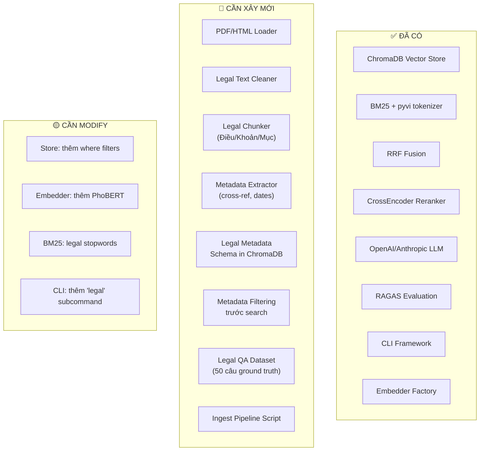
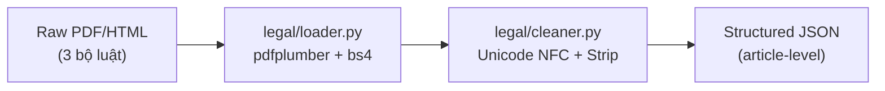
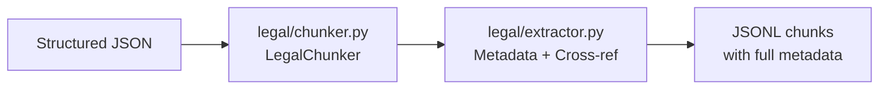
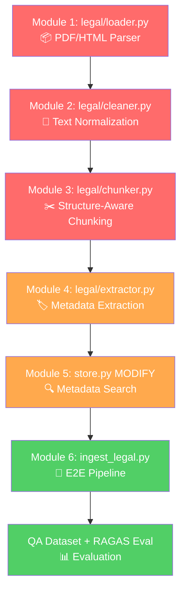

# 🔍 Phân Tích DocChat CLI → Legal RAG System

> **Mục tiêu:** Nhận xét codebase hiện tại → Lộ trình → Core modules → Library & Algorithms
> **Ngày:** 2026-06-22

---

## 1. Nhận Xét Codebase Hiện Tại

### 1.1 Tổng Quan Kiến Trúc



### 1.2 Nhận Xét Từng Module

#### ✅ Điểm Mạnh (Đã Có Sẵn)

| Module | File | Đánh giá | Chi tiết |
|--------|------|----------|----------|
| **Store** | [store.py](file:///c:/Users/Rokisaki/Documents/Coding/Testing_code/test-ai-ds/DocChat_CLI/src/docchat/store.py) | ⭐⭐⭐⭐ | **Rất tốt.** Hybrid search (Dense + BM25 + RRF + CrossEncoder reranker) đã implement đầy đủ. Đây là foundation cực kỳ vững cho Legal RAG. |
| **Embedder** | [embedder.py](file:///c:/Users/Rokisaki/Documents/Coding/Testing_code/test-ai-ds/DocChat_CLI/src/docchat/embedder.py) | ⭐⭐⭐⭐ | Factory pattern sạch, hỗ trợ OpenAI + Local. Dễ thêm PhoBERT/multilingual-e5. |
| **LLM** | [llm.py](file:///c:/Users/Rokisaki/Documents/Coding/Testing_code/test-ai-ds/DocChat_CLI/src/docchat/llm.py) | ⭐⭐⭐⭐⭐ | **Xuất sắc.** Multi-provider (OpenAI + Anthropic), streaming, retry, cost tracking, history management, token budget control. |
| **Evaluate** | [evaluate_rag.py](file:///c:/Users/Rokisaki/Documents/Coding/Testing_code/test-ai-ds/DocChat_CLI/tools/evaluate_rag.py) | ⭐⭐⭐ | RAGAS integration đã sẵn sàng. Cần mở rộng metrics cho legal domain. |
| **CLI** | [cli.py](file:///c:/Users/Rokisaki/Documents/Coding/Testing_code/test-ai-ds/DocChat_CLI/src/docchat/cli.py) | ⭐⭐⭐⭐ | 4 commands rõ ràng (index/ask/chat/info). Dễ thêm subcommand `legal`. |

#### ⚠️ Điểm Yếu — Cần Cải Thiện Cho Legal Domain

| Vấn đề | Module | Mức độ | Chi tiết |
|--------|--------|--------|----------|
| **Chỉ đọc .txt/.md** | [loader.py](file:///c:/Users/Rokisaki/Documents/Coding/Testing_code/test-ai-ds/DocChat_CLI/src/docchat/loader.py) | 🔴 Critical | Không hỗ trợ PDF/HTML — trong khi văn bản pháp luật 100% ở PDF/HTML |
| **Fixed-size chunking** | [chunker.py](file:///c:/Users/Rokisaki/Documents/Coding/Testing_code/test-ai-ds/DocChat_CLI/src/docchat/chunker.py) | 🔴 Critical | `RecursiveCharacterTextSplitter` chia theo token size, không theo cấu trúc Điều/Khoản → chunk sẽ cắt ngang logic pháp luật |
| **Không có metadata pháp luật** | store.py | 🟡 Medium | Metadata hiện tại chỉ có `{source, index, chunk_num}` — thiếu `law_name`, `article`, `clause`, `references`, `status` |
| **Không có text cleaning** | — | 🟡 Medium | Chưa có Unicode normalization, loại bỏ header/footer PDF, xử lý bảng biểu |
| **BM25 chưa tối ưu cho pháp luật** | [store.py:167-181](file:///c:/Users/Rokisaki/Documents/Coding/Testing_code/test-ai-ds/DocChat_CLI/src/docchat/store.py#L167-L181) | 🟡 Medium | Dùng `ViTokenizer` chung — chưa có stopwords pháp luật, chưa boost từ khóa điều luật |
| **Data đang là passage_*.txt** | data/ | 🟢 Low | Hàng nghìn file passage sẵn — dùng cho test cũ, không ảnh hưởng legal pipeline |

### 1.3 Điểm Đặc Biệt Cần Lưu Ý

> [!IMPORTANT]
> **Store module là viên kim cương thô.** Pipeline `Dense → BM25 → RRF → CrossEncoder` ở [store.py:259-336](file:///c:/Users/Rokisaki/Documents/Coding/Testing_code/test-ai-ds/DocChat_CLI/src/docchat/store.py#L259-L336) đã giải quyết được Case 3 (Negative Clause) từ plan. Chỉ cần bổ sung **metadata filtering** trước khi search là có thể handle Case 2 (Versioning) và Case 5 (Polysemy).

> [!WARNING]
> **Loader là bottleneck #1.** Hiện tại chỉ đọc `.txt` và `.md`. Plan yêu cầu PDF + HTML parser cho 3 bộ luật. Đây phải là module đầu tiên được mở rộng.

---

## 2. GAP Analysis: Hiện Tại vs Plan



| Hạng mục | Hiện tại | Plan yêu cầu | Effort |
|----------|----------|---------------|--------|
| Document Loader | `.txt`, `.md` | PDF (`pdfplumber`), HTML (`bs4`) | 🔴 Mới |
| Text Cleaner | Không có | Unicode NFC, header/footer removal, bảng → text | 🔴 Mới |
| Chunker | Fixed-size 400 token | Structure-aware (Chương/Điều/Khoản) + parent-child | 🔴 Mới |
| Metadata | `{source, index, chunk_num}` | `{law_name, article, clause, references, status, effective_date}` | 🔴 Mới |
| Search Filter | Không có | `where={"status": "in_effect", "law_domain": "labor"}` | 🟡 Modify |
| BM25 Index | In-memory, rebuild mỗi lần load | Persistent, legal-aware tokenization | 🟡 Modify |
| Evaluation | Generic RAGAS | Legal-specific QA pairs + domain metrics | 🟡 Extend |
| Embedding | OpenAI + all-MiniLM | + PhoBERT + multilingual-e5 comparison | 🟡 Extend |

---

## 3. Quy Trình Implementation — 4 Phases

### Phase 1: Data Foundation (Tuần 1-3) 📦

> **Mục tiêu:** Thu thập + clean + parse 3 bộ luật thành structured JSON



**Deliverables:**
1. `data/legal/raw/` — 6 file gốc (PDF+HTML × 3 luật)
2. `src/docchat/legal/loader.py` — PDF/HTML parser
3. `src/docchat/legal/cleaner.py` — Text normalization
4. `data/legal/processed/` — JSONL output

### Phase 2: Legal Chunking & Metadata (Tuần 3-5) 🏗️

> **Mục tiêu:** Tách chunks theo cấu trúc pháp luật + gán metadata đầy đủ



**Deliverables:**
1. `src/docchat/legal/chunker.py` — LegalChunker (Regex-based article detection)
2. `src/docchat/legal/extractor.py` — Metadata extraction + cross-reference detection
3. Unit tests cho cả hai

### Phase 3: Search Enhancement (Tuần 5-7) 🔍

> **Mục tiêu:** Upgrade search pipeline để handle 6 case studies

**Deliverables:**
1. Modify `store.py` — Thêm `where` filters cho metadata fields
2. `src/docchat/legal/bm25_index.py` — BM25 với legal stopwords
3. `tools/ingest_legal.py` — End-to-end ingest script
4. ChromaDB indexed với ~3500 chunks

### Phase 4: Evaluation & Polish (Tuần 7-10) 📊

> **Mục tiêu:** Tạo QA dataset, đánh giá RAGAS, viết báo cáo

**Deliverables:**
1. `data/legal/qa_dataset.json` — 50 câu hỏi ground truth
2. RAGAS report (Faithfulness ≥ 0.7)
3. Hybrid vs Dense-only comparison
4. Báo cáo ĐAN

---

## 4. Core Modules — Thứ Tự Implement

### Module 1: `legal/loader.py` — Legal Document Loader 🔴 CRITICAL

**Chức năng:** Parse PDF và HTML văn bản pháp luật VN → plain text có cấu trúc

```python
# Pseudo-code
class LegalDocumentLoader:
    def load_pdf(path: Path) -> LegalDocument:
        """Dùng pdfplumber để extract text + tables từ PDF"""
    
    def load_html(path: Path) -> LegalDocument:
        """Dùng BeautifulSoup để parse HTML từ thuvienphapluat.vn"""
    
    def load_auto(path: Path) -> LegalDocument:
        """Auto-detect format dựa trên extension"""
```

**Library khuyến nghị:**

| Library | Mục đích | Tại sao chọn |
|---------|----------|--------------|
| **`pdfplumber`** | PDF extraction | Tốt nhất cho PDF có bảng biểu — tốt hơn PyPDF2/PyMuPDF cho structured text |
| **`beautifulsoup4`** + `lxml` | HTML parsing | Standard, thuvienphapluat.vn dùng HTML chuẩn |
| **`trafilatura`** (backup) | Web content extraction | Nếu HTML phức tạp hơn expected |

> [!TIP]
> **Ưu tiên HTML hơn PDF.** Theo plan: "thuvienphapluat.vn luôn có HTML tốt hơn". PDF chỉ là fallback khi HTML không available.

---

### Module 2: `legal/cleaner.py` — Vietnamese Legal Text Cleaner 🔴 CRITICAL

**Chức năng:** Chuẩn hóa text tiếng Việt đặc thù pháp luật

```python
class LegalTextCleaner:
    def normalize_unicode(text: str) -> str:
        """NFC normalization + sửa dấu tiếng Việt sai vị trí"""
    
    def remove_artifacts(text: str) -> str:
        """Loại header/footer trang, số trang, watermark"""
    
    def table_to_prose(table_data: list) -> str:
        """Convert bảng biểu → câu văn xuôi"""
    
    def clean(text: str) -> str:
        """Pipeline: normalize → remove → merge"""
```

**Library & phương pháp:**

| Library | Mục đích |
|---------|----------|
| **`unicodedata`** (stdlib) | NFC normalization |
| **`regex`** (thay `re`) | Unicode-aware regex, xử lý dấu tiếng Việt chính xác hơn |
| **`underthesea`** | Vietnamese NLP toolkit — word segmentation, POS tagging |
| **`pyvi`** ✅ Đã có | ViTokenizer cho word segmentation |

> [!NOTE]
> **Vietnamese Unicode pitfall:** Tiếng Việt có 2 cách encode dấu (precomposed vs decomposed). VD: "ổ" có thể là 1 codepoint hoặc "o" + "combining horn" + "combining dot below". `unicodedata.normalize("NFC", text)` là bắt buộc trước bất kỳ xử lý nào.

---

### Module 3: `legal/chunker.py` — LegalChunker (Structure-Aware) 🔴 CRITICAL

**Chức năng:** Chia chunks theo cấu trúc Chương → Mục → Điều → Khoản (không dùng fixed-size)

**Thuật toán đề xuất:**

```
1. Regex Detection Phase:
   - Detect "CHƯƠNG [I-XX]" → chapter boundary
   - Detect "Mục [1-99]" → section boundary  
   - Detect "Điều [1-999]." → article boundary
   - Detect "1.", "2.", "a)", "b)" → clause/point level

2. Hierarchical Chunking:
   - Mỗi Điều = 1 parent chunk
   - Mỗi Khoản = 1 child chunk (inherit parent context)
   - Parent context = "Chương X: ... | Điều Y: [tiêu đề]"

3. Overlap Strategy:
   - KHÔNG dùng character overlap
   - Dùng "shadow context" = prepend header path vào mỗi chunk
```

**Phương pháp:**

| Approach | Mô tả | Phù hợp? |
|----------|--------|----------|
| **Regex-based structural** ✅ | Dùng regex pattern cho "Điều X", "Khoản Y" | ✅ Tốt nhất cho VN legal — cấu trúc rất chuẩn |
| Semantic chunking (LLM) | Dùng LLM để detect boundaries | ❌ Quá chậm cho 1050 điều |
| Layout-based (PDF) | Dùng font size/style detect headers | ⚠️ Backup nếu regex fail |
| **Parent-child (LangChain)** | `ParentDocumentRetriever` | ⚠️ Tham khảo concept, nhưng custom regex tốt hơn |

> [!IMPORTANT]
> **Key insight:** Cấu trúc pháp luật Việt Nam RẤT chuẩn (Luật Ban hành Văn bản Quy phạm Pháp luật quy định). Regex patterns sẽ cover 95%+ trường hợp. Không cần LLM-based chunking.

---

### Module 4: `legal/extractor.py` — Metadata & Cross-Reference Extractor 🟡 HIGH

**Chức năng:** Trích xuất metadata pháp luật + phát hiện tham chiếu chéo

```python
class LegalMetadataExtractor:
    def extract_law_info(text: str) -> dict:
        """Trích: số hiệu, ngày ban hành, cơ quan"""
    
    def detect_cross_references(text: str) -> list[str]:
        """Phát hiện 'theo Điều X', 'quy định tại Khoản Y Điều Z'"""
    
    def classify_domain(law_number: str) -> str:
        """Gán domain: labor | insurance | civil"""
```

**Regex patterns chính:**

```python
# Cross-reference patterns
CROSS_REF_PATTERNS = [
    r"(?:theo|tại|quy định tại)\s+(?:khoản\s+\d+\s+)?Điều\s+\d+",
    r"Điều\s+\d+\s+(?:của\s+)?(?:Bộ luật|Luật)\s+\w+",
    r"(?:khoản|điểm)\s+\w+\s+Điều\s+\d+",
]

# Law number pattern
LAW_NUMBER = r"\d+/\d{4}/QH\d+"
```

---

### Module 5: `store.py` (MODIFY) — Metadata-Aware Search 🟡 HIGH

**Thay đổi cần thiết trong** [store.py](file:///c:/Users/Rokisaki/Documents/Coding/Testing_code/test-ai-ds/DocChat_CLI/src/docchat/store.py):

1. **`add()` method** — Lưu thêm legal metadata vào ChromaDB metadatas
2. **`search()` method** — Thêm parameter `filters: dict` → pass xuống `self._collection.query(where=filters)`
3. **`_init_bm25()` method** — Thêm legal stopwords trước khi tokenize

```python
# Hiện tại (line 249):
metadatas.append({"source": str(c.source), "index": int(c.index), "chunk_num": int(c.chunk_num)})

# Sau khi modify:
metadatas.append({
    "source": str(c.source),
    "index": int(c.index),
    "chunk_num": int(c.chunk_num),
    # Legal metadata
    "law_name": c.metadata.get("law_name", ""),
    "law_domain": c.metadata.get("law_domain", ""),
    "article": c.metadata.get("article", ""),
    "clause": c.metadata.get("clause", ""),
    "status": c.metadata.get("status", "in_effect"),
})
```

---

### Module 6: `tools/ingest_legal.py` — End-to-End Ingest Script 🟡 MEDIUM

**Chức năng:** Orchestrate toàn bộ pipeline từ raw → indexed

```
Raw files → Loader → Cleaner → Chunker → Extractor → Embedder → ChromaDB
```

---

## 5. Library & Algorithm Recommendations

### 5.1 Data Processing

| Giai đoạn | Library | Version | Mục đích |
|-----------|---------|---------|----------|
| PDF Parse | **`pdfplumber`** | ≥0.10 | Extract text + tables từ PDF pháp luật |
| HTML Parse | **`beautifulsoup4`** + `lxml` | ≥4.12 | Parse HTML từ thuvienphapluat.vn |
| Unicode | **`regex`** | ≥2024.0 | Unicode-aware regex (tốt hơn `re` cho tiếng Việt) |
| VN NLP | **`underthesea`** | ≥6.8 | Word segmentation, NER, POS tagging |
| VN Tokenize | **`pyvi`** ✅ đã có | ≥0.1 | ViTokenizer cho BM25 |
| Data format | **`orjsonl`** hoặc stdlib `json` | — | Read/write JSONL chunks |

### 5.2 Embedding Models — So Sánh Cho Legal Vietnamese

| Model | Type | Dim | Ưu điểm | Nhược điểm | Phù hợp? |
|-------|------|-----|---------|------------|----------|
| **`text-embedding-3-small`** ✅ đã có | API (OpenAI) | 1536 | Multilingual tốt, rẻ ($0.02/1M tokens) | Cần API key, latency | ✅ Baseline |
| **`multilingual-e5-large`** | Local (HuggingFace) | 1024 | SOTA multilingual, instruction-following | GPU recommended, 2.2GB | ✅✅ Recommended KLTN |
| **`bge-m3`** (BAAI) | Local | 1024 | Hybrid dense+sparse+colbert, 100+ languages | Heavy (2.4GB) | ✅✅ Best cho hybrid |
| **`VoVanPhuc/sup-SimCSE-VietNamese-phobert-base`** | Local | 768 | Train trên Vietnamese data, hiểu ngữ cảnh VN | Chỉ Vietnamese, nhỏ | ⚠️ Test thêm |
| **`vinai/phobert-base-v2`** | Local | 768 | SOTA Vietnamese NLU, pre-trained trên legal text | Cần fine-tune cho embedding | ⚠️ Cần effort |
| **`sentence-transformers/paraphrase-multilingual-MiniLM-L12-v2`** | Local | 384 | Nhẹ, nhanh, multilingual | Accuracy thấp hơn | ⚠️ Chỉ dùng dev/test |

> [!TIP]
> **Khuyến nghị ĐAN:** Dùng `text-embedding-3-small` (đã có) làm baseline.
> **Khuyến nghị KLTN:** So sánh 3 models: `text-embedding-3-small` vs `multilingual-e5-large` vs `bge-m3`. Đây là contribution rõ ràng cho paper.

### 5.3 Chunking Algorithms

| Phương pháp | Mô tả | Khi nào dùng |
|-------------|--------|-------------|
| **Structural Chunking** ✅ | Parse theo Điều/Khoản bằng regex | Primary — cho legal text |
| **Parent-Child Retrieval** | Chunk nhỏ (khoản) + retrieve parent (điều) | Kết hợp với structural |
| **Sliding Window** (hiện tại) | Fixed-size + overlap | ❌ Không dùng cho legal |
| **Semantic Chunking** | Dùng embedding similarity detect boundaries | Backup — cho text không chuẩn |
| **Agentic Chunking** | LLM-based boundary detection | ❌ Quá chậm, quá đắt |

### 5.4 Search & Retrieval Algorithms

| Thuật toán | Đã có? | Chi tiết |
|-----------|--------|----------|
| **Dense Retrieval** (Cosine Similarity) | ✅ | ChromaDB built-in |
| **BM25 Okapi** (Sparse) | ✅ | `rank_bm25` + `pyvi` |
| **RRF (Reciprocal Rank Fusion)** | ✅ | [store.py:338-351](file:///c:/Users/Rokisaki/Documents/Coding/Testing_code/test-ai-ds/DocChat_CLI/src/docchat/store.py#L338-L351) |
| **CrossEncoder Reranking** | ✅ | `mmarco-mMiniLMv2-L12-H384-v1` |
| **Metadata Pre-filtering** | ❌ Cần thêm | `where={"law_domain": "labor", "status": "in_effect"}` |
| **Query Expansion** | ❌ Optional KLTN | Dùng LLM expand query trước search |
| **HyDE (Hypothetical Document Embedding)** | ❌ Optional KLTN | LLM generate answer giả → embed → search |

### 5.5 Evaluation Framework

| Metric | Library | Mô tả |
|--------|---------|--------|
| **Faithfulness** | `ragas` ✅ | Câu trả lời có đúng theo context? |
| **Answer Relevancy** | `ragas` ✅ | Câu trả lời có liên quan câu hỏi? |
| **Context Recall** | `ragas` ✅ | Context có cover ground truth? |
| **Context Precision** | `ragas` | Tỷ lệ context liên quan / tổng context |
| **Recall@K** | Custom | Bao nhiêu điều luật đúng nằm trong top-K? |
| **Hybrid vs Dense A/B** | Custom | So sánh recall giữa 2 mode |

### 5.6 Advanced Techniques (KLTN)

| Kỹ thuật | Mục đích | Library |
|----------|----------|---------|
| **LangGraph** | Multi-step legal reasoning agent | `langgraph` |
| **ColBERT** | Token-level similarity (tốt cho negative clause) | `ragatouille` hoặc `bge-m3` |
| **Fine-tuning PhoBERT** | Domain-specific embedding | `sentence-transformers` + custom dataset |
| **Named Entity Recognition** | Detect entities: tên luật, số điều, tổ chức | `underthesea` NER |
| **Query Classification** | Phân loại câu hỏi: single-doc vs cross-doc | LLM router |

---

## 6. Dependency Graph — Thứ Tự Implement



---

## 7. 🛑 Câu Hỏi Cần Trả Lời Trước Khi Bắt Tay Implement

> [!CAUTION]
> **Socratic Gate — Trả lời những câu hỏi này trước khi code:**

### Về Data:
1. **HTML vs PDF priority:** Bạn đã tải sẵn file nào rồi? Muốn bắt đầu với HTML (dễ hơn) hay PDF (khó hơn nhưng official)?
2. **Nguồn chính xác:** Dùng `thuvienphapluat.vn` (HTML tốt) hay `congbao.gov.vn` (PDF official)?
3. **Bộ luật Dân sự 2015** có 689 điều — rất lớn. ĐAN có cần toàn bộ 689 điều hay chỉ phần liên quan lao động (Hợp đồng, Bồi thường)?

### Về Architecture:
4. **Chunk Dataclass hiện tại** chỉ có 5 field. Bạn muốn extend `Chunk` (backward-compatible) hay tạo `LegalChunk` mới (kế thừa `Chunk`)?
5. **BM25 persistent:** Muốn save BM25 index ra file (pickle/json) để không rebuild mỗi lần load? Hay chấp nhận rebuild ~3500 chunks mỗi lần?

### Về Scope:
6. **ĐAN timeline:** 10 tuần bắt đầu từ khi nào? Tuần mấy rồi?
7. **Embedding model:** ĐAN chỉ dùng 1 model (text-embedding-3-small) hay muốn bắt đầu so sánh sớm?

---

*Artifact by project-planner + backend-specialist | 2026-06-22*
