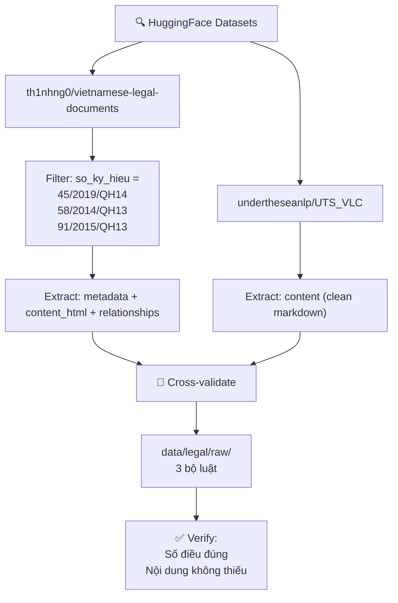

# Phase 1: Data Foundation — Nghiên cứu Thu thập Data

> **Dự án:** Law Assistant · **Giai đoạn:** Phase 1 (Tuần 1-3)
> **Mục tiêu:** Thu thập & chuẩn bị corpus 3 bộ luật cho hệ thống RAG

---

## 1. Bản đồ Nguồn Dữ liệu

Sau khi khảo sát, có **3 nguồn dataset có sẵn** trên HuggingFace phù hợp với dự án:

### 1.1 So sánh tổng quan

| Tiêu chí | `th1nhng0/vietnamese-legal-documents` | `undertheseanlp/UTS_VLC` | `duyet/vietnamese-legal-instruct` |
|---|---|---|---|
| **Số lượng** | 500K+ văn bản | < 1K (chỉ Luật + Bộ luật + Hiến pháp) | ~468K cặp instruction |
| **Loại VB** | Luật, Nghị định, Thông tư, Quyết định... | Chỉ Luật & Bộ luật (top-level) | QA pairs từ văn bản luật |
| **Nguồn gốc** | vbpl.vn (Cổng Pháp luật Bộ Tư pháp) | vbpl.vn (đã xác minh) | Sinh tự động từ dataset pháp luật |
| **Định dạng nội dung** | HTML → Markdown | Markdown (đã clean) | Conversations (role/content) |
| **Metadata** | ✅ Rất phong phú | ⚠️ Cơ bản (số hiệu, loại) | ❌ Chỉ có `source_id`, `qa_type` |
| **Relationships** | ✅ Có (amendments, repeals, references) | ❌ Không | ❌ Không |
| **License** | CC BY 4.0 | MIT | Không rõ |
| **Phù hợp RAG** | ⭐⭐⭐⭐⭐ | ⭐⭐⭐⭐ | ⭐⭐ (dùng cho eval/fine-tune) |

---

### 1.2 Chi tiết từng Dataset

#### 🥇 Dataset 1: `th1nhng0/vietnamese-legal-documents`

> **Đây là nguồn CHÍNH** — phù hợp nhất cho dự án Law Assistant.

**Cấu trúc (4 subsets):**

```
th1nhng0/vietnamese-legal-documents/
├── content/        # Nội dung đầy đủ (HTML → Markdown)
│   ├── id              (string)  — ID văn bản
│   └── content_html    (string)  — Toàn văn dạng HTML
│
├── metadata/       # Thông tin chi tiết
│   ├── id              (int64)   — ID văn bản (join key)
│   ├── title           (string)  — Tiêu đề VB
│   ├── so_ky_hieu      (string)  — Số ký hiệu (vd: "45/2019/QH14")
│   ├── loai_van_ban    (string)  — Loại VB (Bộ luật, Luật, Nghị định...)
│   ├── ngay_ban_hanh   (string)  — Ngày ban hành
│   ├── ngay_co_hieu_luc(string)  — Ngày có hiệu lực
│   ├── ngay_het_hieu_luc(string) — Ngày hết hiệu lực
│   ├── tinh_trang_hieu_luc(str) — Trạng thái (Còn hiệu lực / Hết hiệu lực)
│   ├── co_quan_ban_hanh(string)  — Cơ quan ban hành
│   ├── nguoi_ky        (string)  — Người ký
│   ├── nganh           (string)  — Ngành
│   ├── linh_vuc        (string)  — Lĩnh vực
│   ├── pham_vi         (string)  — Phạm vi áp dụng
│   └── nguon_thu_thap  (string)  — Nguồn thu thập
│
├── relationships/  # Quan hệ giữa các văn bản ★
│   ├── doc_id          (int64)   — ID văn bản nguồn
│   ├── other_doc_id    (string)  — ID văn bản đích
│   └── relationship    (string)  — Loại quan hệ (sửa đổi, bãi bỏ, dẫn chiếu)
│
└── legacy/         # Định dạng cũ (2 splits: content + metadata)
    ├── id, document_number, title, legal_type
    ├── legal_sectors, issuing_authority
    ├── issuance_date, effect_date, effectless_date
    ├── effect_status, signers
    └── (content trong split content)
```

**Điểm mạnh cho Law Assistant:**
- ✅ Metadata `so_ky_hieu` → map chính xác 3 bộ luật mục tiêu
- ✅ `tinh_trang_hieu_luc` → filter văn bản còn hiệu lực
- ✅ `relationships` → cross-reference giữa các luật (Case 1 trong Plan)
- ✅ `linh_vuc` → phân loại domain (labor, insurance, civil)
- ✅ Nội dung dạng HTML → dễ parse cấu trúc Điều/Khoản bằng BeautifulSoup

---

#### 🥈 Dataset 2: `undertheseanlp/UTS_VLC`

> **Nguồn BỔ SUNG** — dữ liệu sạch, đã xác minh, nhưng ít metadata.

**Cấu trúc:**

```
undertheseanlp/UTS_VLC/
├── Splits: 2026, 2026_01, 2023, 2021
│
├── id              (string)  — ID văn bản
├── filename        (string)  — Tên file
├── title           (string)  — Tiêu đề
├── type            (string)  — Loại (Hiến pháp, Bộ luật, Luật)
├── content         (string)  — Toàn văn dạng Markdown (đã clean!)
└── content_length  (int32)   — Độ dài nội dung
```

**Điểm mạnh:**
- ✅ Nội dung đã được **clean sạch** (Markdown), giảm công xử lý `cleaner.py`
- ✅ Đã **xác minh còn hiệu lực** (split 2026 = snapshot hiện hành)
- ✅ Chỉ chứa Luật/Bộ luật cấp cao → không bị nhiễu bởi nghị định, thông tư
- ⚠️ Thiếu metadata chi tiết (không có `so_ky_hieu`, `ngay_co_hieu_luc`)
- ⚠️ Không có `relationships`

---

#### 🥉 Dataset 3: `duyet/vietnamese-legal-instruct`

> **Dùng cho Phase sau** — phù hợp cho evaluation hoặc fine-tuning LLM.

**Cấu trúc:** ~468K cặp instruction-response

```json
{
  "conversations": [
    {"role": "user", "content": "Câu hỏi pháp luật..."},
    {"role": "assistant", "content": "Trả lời chi tiết..."}
  ],
  "document_type": "Bộ luật",
  "qa_type": "factual",
  "source_id": "45/2019/QH14"
}
```

**Dùng được cho:**
- Tạo bộ Ground Truth QA (thay vì viết tay 50 câu)
- Fine-tune LLM nếu cần ở giai đoạn KLTN
- **KHÔNG dùng** làm corpus chính cho RAG

---

## 2. Chiến lược Thu thập Data — Recommended

> [!IMPORTANT]
> **Kết hợp 2 nguồn:** Dùng `th1nhng0` làm nguồn chính (metadata + relationships phong phú), dùng `UTS_VLC` để đối chiếu và lấy bản clean.

### 2.1 Sơ đồ quy trình



### 2.2 Các bước cụ thể

#### Bước 1: Cài đặt thư viện

```bash
uv add datasets pandas
```

#### Bước 2: Script trích xuất 3 bộ luật từ `th1nhng0`

```python
# tools/extract_legal_corpus.py

from datasets import load_dataset
import pandas as pd
import json
from pathlib import Path

# === CONFIG ===
TARGET_LAWS = {
    "45/2019/QH14": {
        "name": "Bộ luật Lao động 2019",
        "domain": "labor",
        "expected_articles": 220,
        "filename": "bo_luat_lao_dong_2019",
    },
    "58/2014/QH13": {
        "name": "Luật Bảo hiểm Xã hội 2014",
        "domain": "insurance",
        "expected_articles": 141,
        "filename": "luat_bhxh_2014",
    },
    "91/2015/QH13": {
        "name": "Bộ luật Dân sự 2015",
        "domain": "civil",
        "expected_articles": 689,
        "filename": "bo_luat_dan_su_2015",
    },
}

OUTPUT_DIR = Path("data/legal/raw")
OUTPUT_DIR.mkdir(parents=True, exist_ok=True)


def extract_from_th1nhng0():
    """Extract 3 target laws from th1nhng0/vietnamese-legal-documents."""
    
    print("📥 Loading metadata subset...")
    metadata_ds = load_dataset(
        "th1nhng0/vietnamese-legal-documents",
        "metadata",
        split="data",
    )
    metadata_df = metadata_ds.to_pandas()

    # Filter 3 target laws by so_ky_hieu
    target_ids = []
    for so_ky_hieu, info in TARGET_LAWS.items():
        matches = metadata_df[
            metadata_df["so_ky_hieu"].str.contains(so_ky_hieu, na=False)
        ]
        if matches.empty:
            print(f"  ⚠️ Không tìm thấy: {so_ky_hieu} ({info['name']})")
            # Try fuzzy match on title
            matches = metadata_df[
                metadata_df["title"].str.contains(
                    info["name"].split(" ")[0], na=False
                )
            ]
        
        if not matches.empty:
            doc_id = matches.iloc[0]["id"]
            target_ids.append((so_ky_hieu, doc_id, info))
            print(f"  ✅ Found: {info['name']} (id={doc_id})")
            
            # Save metadata
            meta_path = OUTPUT_DIR / f"{info['filename']}_metadata.json"
            meta_record = matches.iloc[0].to_dict()
            # Convert non-serializable types
            for k, v in meta_record.items():
                if pd.isna(v):
                    meta_record[k] = None
                elif hasattr(v, 'item'):
                    meta_record[k] = v.item()
            with open(meta_path, "w", encoding="utf-8") as f:
                json.dump(meta_record, f, ensure_ascii=False, indent=2)
            print(f"    → Saved metadata: {meta_path}")
        else:
            print(f"  ❌ NOT FOUND: {so_ky_hieu} ({info['name']})")

    # Load content for matched IDs
    if target_ids:
        print("\n📥 Loading content subset...")
        content_ds = load_dataset(
            "th1nhng0/vietnamese-legal-documents",
            "content",
            split="data",
        )
        content_df = content_ds.to_pandas()

        for so_ky_hieu, doc_id, info in target_ids:
            content_match = content_df[content_df["id"] == str(doc_id)]
            if not content_match.empty:
                html_content = content_match.iloc[0]["content_html"]
                html_path = OUTPUT_DIR / f"{info['filename']}.html"
                with open(html_path, "w", encoding="utf-8") as f:
                    f.write(html_content)
                print(f"  ✅ Saved content: {html_path} ({len(html_content):,} chars)")
            else:
                print(f"  ⚠️ Content not found for id={doc_id}")

    # Load relationships
    print("\n📥 Loading relationships subset...")
    rel_ds = load_dataset(
        "th1nhng0/vietnamese-legal-documents",
        "relationships",
        split="data",
    )
    rel_df = rel_ds.to_pandas()
    
    matched_doc_ids = [doc_id for _, doc_id, _ in target_ids]
    relevant_rels = rel_df[
        (rel_df["doc_id"].isin(matched_doc_ids))
        | (rel_df["other_doc_id"].isin([str(d) for d in matched_doc_ids]))
    ]
    
    if not relevant_rels.empty:
        rel_path = OUTPUT_DIR / "relationships.json"
        relevant_rels.to_json(rel_path, orient="records", force_ascii=False, indent=2)
        print(f"  ✅ Saved {len(relevant_rels)} relationships: {rel_path}")


def extract_from_uts_vlc():
    """Extract clean markdown from UTS_VLC for cross-validation."""
    
    print("\n📥 Loading UTS_VLC (split=2026)...")
    ds = load_dataset("undertheseanlp/UTS_VLC", split="2026")
    df = ds.to_pandas()

    # Search by title keywords
    search_terms = {
        "lao_dong": ["Lao động", "lao động"],
        "bhxh": ["bảo hiểm xã hội", "Bảo hiểm xã hội"],
        "dan_su": ["Dân sự", "dân sự"],
    }

    for key, terms in search_terms.items():
        for term in terms:
            matches = df[df["title"].str.contains(term, case=False, na=False)]
            if not matches.empty:
                for _, row in matches.iterrows():
                    filename = f"uts_vlc_{key}_{row['id']}.md"
                    md_path = OUTPUT_DIR / filename
                    with open(md_path, "w", encoding="utf-8") as f:
                        f.write(f"# {row['title']}\n\n")
                        f.write(row["content"])
                    print(f"  ✅ UTS_VLC: {row['title'][:60]}... → {md_path}")
                    print(f"     Type: {row['type']}, Length: {row['content_length']:,} chars")
                break


if __name__ == "__main__":
    print("=" * 60)
    print("📦 LAW ASSISTANT — Phase 1: Extract Legal Corpus")
    print("=" * 60)
    
    extract_from_th1nhng0()
    extract_from_uts_vlc()
    
    print("\n" + "=" * 60)
    print("✅ Extraction complete! Check: data/legal/raw/")
    print("=" * 60)
```

#### Bước 3: Cấu trúc output mong đợi

```
data/legal/
├── raw/
│   ├── bo_luat_lao_dong_2019.html           ← Toàn văn HTML (th1nhng0)
│   ├── bo_luat_lao_dong_2019_metadata.json   ← Metadata đầy đủ
│   ├── luat_bhxh_2014.html
│   ├── luat_bhxh_2014_metadata.json
│   ├── bo_luat_dan_su_2015.html
│   ├── bo_luat_dan_su_2015_metadata.json
│   ├── relationships.json                    ← Cross-references
│   ├── uts_vlc_lao_dong_*.md                 ← Clean markdown (đối chiếu)
│   ├── uts_vlc_bhxh_*.md
│   └── uts_vlc_dan_su_*.md
│
├── processed/                                ← (Phase 2: sau khi clean + chunk)
│   └── (sẽ tạo ở Phase 2)
│
└── metadata/
    └── corpus_info.json                      ← Tổng quan corpus
```

---

## 3. Quy trình Xác minh Dữ liệu (Data Verification)

> [!WARNING]
> **KHÔNG được bỏ qua bước này.** Dữ liệu từ HuggingFace có thể thiếu hoặc lỗi. Cần xác minh thủ công trước khi đưa vào pipeline.

### 3.1 Checklist xác minh

| # | Kiểm tra | Phương pháp | Pass/Fail |
|---|----------|-------------|-----------|
| 1 | **Số hiệu đúng** | So sánh `so_ky_hieu` với congbao.chinhphu.vn | ☐ |
| 2 | **Nội dung đầy đủ** | Kiểm tra Điều đầu + Điều cuối của mỗi luật | ☐ |
| 3 | **Số điều khớp** | Regex đếm `Điều \d+` → so sánh với kỳ vọng | ☐ |
| 4 | **Unicode chuẩn** | Không có ký tự lỗi, dấu tiếng Việt đúng | ☐ |
| 5 | **Hiệu lực** | `tinh_trang_hieu_luc` = "Còn hiệu lực" | ☐ |
| 6 | **Cross-validate** | So sánh content từ `th1nhng0` vs `UTS_VLC` | ☐ |

### 3.2 Script xác minh nhanh

```python
# tools/verify_legal_corpus.py

import re
import json
from pathlib import Path

DATA_DIR = Path("data/legal/raw")

EXPECTED = {
    "bo_luat_lao_dong_2019": {"articles": 220, "first": 1, "last": 220},
    "luat_bhxh_2014": {"articles": 141, "first": 1, "last": 141},
    "bo_luat_dan_su_2015": {"articles": 689, "first": 1, "last": 689},
}


def count_articles(filepath: Path) -> list[int]:
    """Count and extract article numbers from a file."""
    content = filepath.read_text(encoding="utf-8")
    # Match "Điều X" or "Điều X." patterns
    matches = re.findall(r"Điều\s+(\d+)", content)
    return sorted(set(int(m) for m in matches))


def verify():
    print("🔍 Verifying Legal Corpus...")
    print("-" * 50)
    
    for name, expected in EXPECTED.items():
        # Check HTML file
        html_file = DATA_DIR / f"{name}.html"
        if not html_file.exists():
            print(f"❌ MISSING: {html_file}")
            continue
        
        articles = count_articles(html_file)
        
        status = "✅" if len(articles) >= expected["articles"] * 0.9 else "⚠️"
        print(f"{status} {name}:")
        print(f"   Found: {len(articles)} articles (expected ≥ {expected['articles']})")
        
        if articles:
            print(f"   Range: Điều {articles[0]} → Điều {articles[-1]}")
        
        # Check for gaps
        if articles:
            full_range = set(range(articles[0], articles[-1] + 1))
            missing = full_range - set(articles)
            if missing and len(missing) < 20:
                print(f"   ⚠️ Missing articles: {sorted(missing)}")
            elif missing:
                print(f"   ⚠️ {len(missing)} articles missing")
        
        # Check metadata
        meta_file = DATA_DIR / f"{name}_metadata.json"
        if meta_file.exists():
            meta = json.loads(meta_file.read_text(encoding="utf-8"))
            print(f"   Hiệu lực: {meta.get('tinh_trang_hieu_luc', 'N/A')}")
            print(f"   Ngày ban hành: {meta.get('ngay_ban_hanh', 'N/A')}")
        
        print()


if __name__ == "__main__":
    verify()
```

---

## 4. Các Dự án Tham khảo trên GitHub

> [!TIP]
> Các dự án dưới đây đã làm Legal RAG cho tiếng Việt — tham khảo kiến trúc và cách xử lý data.

| Dự án | Mô tả | Tham khảo được gì |
|---|---|---|
| [NamSyntax/vietnamese-rag-system](https://github.com/NamSyntax/vietnamese-rag-system) | RAG cho Luật Giao thông VN | Hybrid search (Qdrant), dense + sparse, agentic RAG |
| [ngothanhnam0910/Vietnamese-Law-QA](https://github.com/ngothanhnam0910/Vietnamese-Law-Question-Answering-system) | Chatbot QA pháp luật | Quy trình RAG hoàn chỉnh, reranking |
| [duyet/vietnamese-legal-documents-dataset](https://github.com/duyet/vietnamese-legal-documents-dataset) | Pipeline xử lý data pháp luật | Cách tạo instruction dataset, cấu trúc data |

---

## 5. Câu hỏi Quyết định — Cần trả lời trước khi bắt tay

> [!IMPORTANT]
> Trả lời các câu hỏi sau để tôi có thể tạo script chính xác cho bạn.

1. **Bộ luật Dân sự 2015 (689 điều)** — Lấy toàn bộ hay chỉ lấy phần liên quan lao động (Quyển III: Nghĩa vụ & Hợp đồng)?
   - Toàn bộ = ~3500 chunks, xử lý lâu hơn
   - Chỉ phần liên quan = ~800 chunks, tập trung hơn

2. **Định dạng ưu tiên** — Dùng HTML (từ `th1nhng0`, giàu structure) hay Markdown (từ `UTS_VLC`, đã clean)?
   - HTML → cần `cleaner.py` + `BeautifulSoup` nhưng giữ được cấu trúc tốt hơn
   - Markdown → dùng regex parse, nhanh hơn nhưng có thể mất cấu trúc bảng

3. **Chạy script ngay?** — Bạn muốn tôi chạy script `extract_legal_corpus.py` luôn hay muốn review trước?

---

## 6. Timeline Phase 1

| Ngày | Task | Output |
|------|------|--------|
| **Tuần 1** | Chạy script extract + verify | 6 file raw + metadata |
| **Tuần 2** | Viết `cleaner.py` (chuẩn hóa Unicode, loại header/footer) | Clean text files |
| **Tuần 3** | Viết `LegalChunker` + `extractor.py` | JSONL chunks + metadata |

> **Kết quả Phase 1:** `data/legal/processed/` chứa ~3000-4000 chunks JSONL với metadata pháp lý đầy đủ, sẵn sàng cho Phase 2 (Embedding + Indexing).
